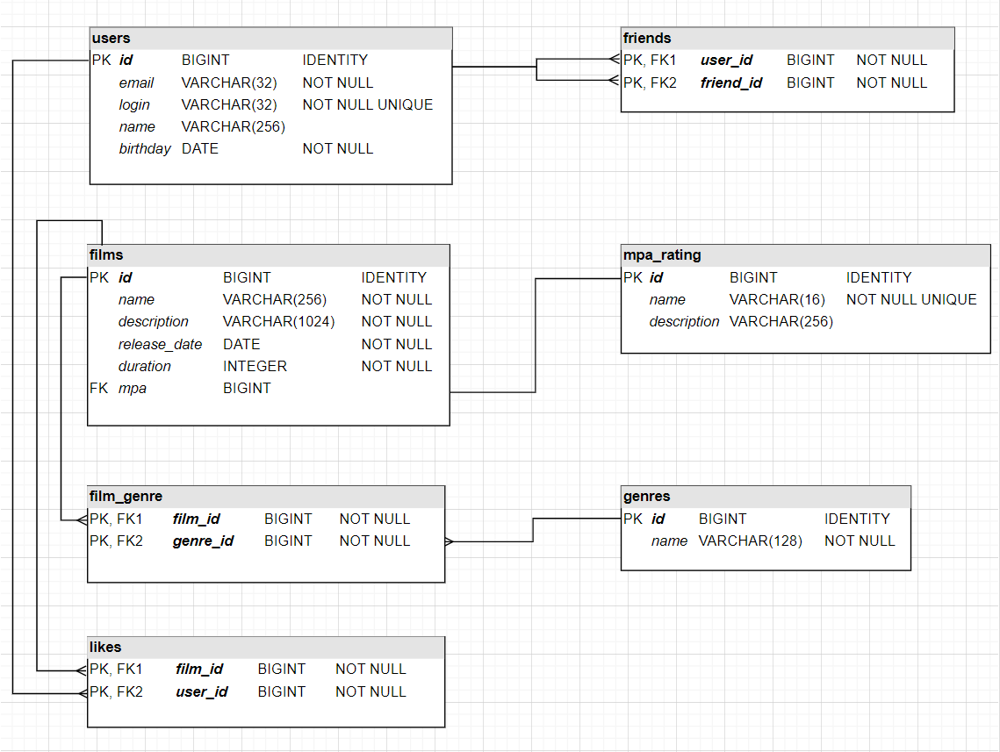

# java-filmorate

## Database diagram


###### SQLs
```SQL
-- get all
SELECT *
    FROM [table_name]
    [ORDER BY id]

-- get one by id
SELECT *
    FROM [table_name]
    WHERE id = ?

-- check existence
SELECT NULL
    FROM [table_name]
    WHERE id = ?

-- update a user 
UPDATE users
    SET email = ?, login = ?, name = ?, birthday = ? 
    WHERE id = ?

-- add a friend
INSERT INTO friends
    SELECT ?, ?
        WHERE NOT EXISTS (
            SELECT NULL
                FROM friends
                WHERE user_id = ? AND friend_id = ?)

-- delete a friend
DELETE FROM friends
    WHERE user_id = ? AND friend_id = ?

-- get friends
SELECT *
    FROM users u JOIN friends f ON f.friend_id = u.id
    WHERE f.user_id = ?

-- get common friends
SELECT *
    FROM users
    WHERE id IN (SELECT friend_id FROM friends WHERE user_id = ?)
        AND id IN (SELECT friend_id FROM friends WHERE user_id = ?)

-- get the genres' identificators of a film
SELECT genre_id
    FROM film_genre
    WHERE film_id = ?
    ORDER BY genre_id

-- update a film
UPDATE films
SET name = ?, description = ?, release_date = ?, duration = ?, mpa = ?
    WHERE id = ?

-- delete the genres of a film
DELETE FROM film_genre
    WHERE film_id = ?

-- insert the genres of a film
INSERT INTO film_genre VALUES (?, ?)

-- put a like
INSERT INTO likes
    SELECT ?, ?
        WHERE NOT EXISTS (
            SELECT NULL
                FROM likes
                WHERE film_id = ? AND user_id = ?)

-- remove a like
DELETE FROM likes
    WHERE film_id = ? AND user_id = ?

-- get most popular films with limit
SELECT *
    FROM films
    WHERE id IN (
        SELECT f.id
            FROM films f LEFT JOIN likes l ON l.film_id = f.id
            GROUP BY f.id
            ORDER BY COUNT(l.user_id) DESC
            LIMIT ?)
```
